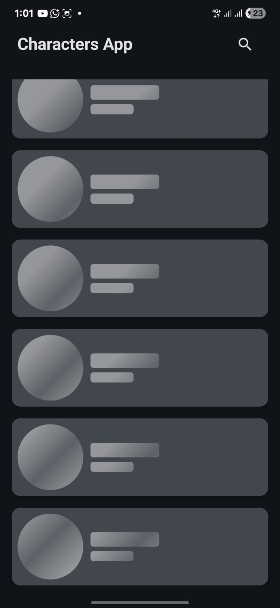
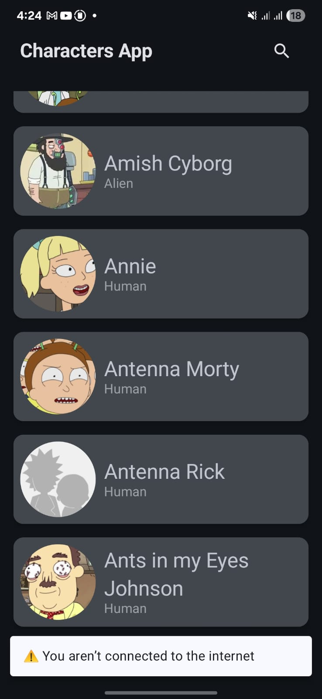
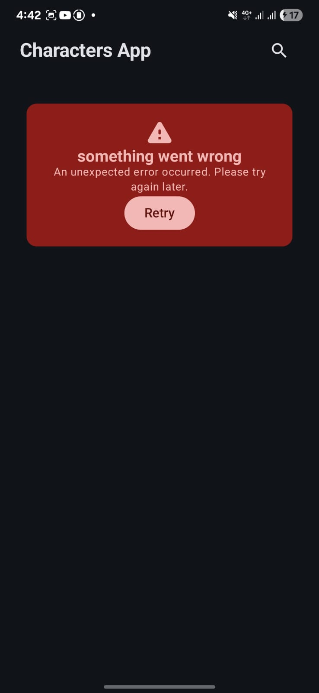
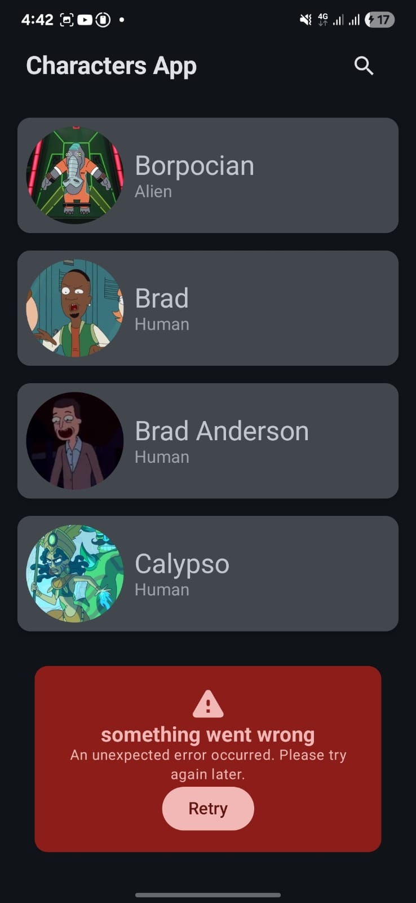
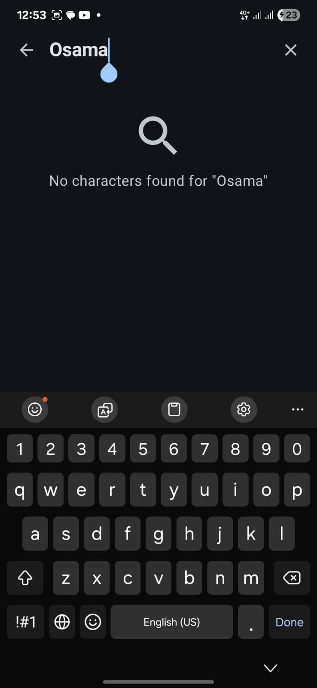

<p align="center">
  
</p>

# Characters App

[](LICENSE)
[](https://ktlint.github.io/)
[](https://github.com/osamasayed585/Characters-App/actions/workflows/job_lint_debug.yml)
[](https://github.com/osamasayed585/Characters-App/actions/workflows/job_test_debug.yml)
[](https://github.com/osamasayed585/Characters-App/actions/workflows/deploy_to_firebase.yml)


## Overview
This Android application is built with **Kotlin** and **Jetpack Compose**. It fetches data from the [Rick and Morty API](https://rickandmortyapi.com/) and displays characters in a paginated list. The project is designed as a showcase of modern Android development, applying clean architecture principles and modularity while demonstrating elegant UI design with Jetpack Compose.

---

## Features

### Screen 1: Character List
- Displays a paginated list of characters (20 per page).  
- Supports **searching** characters by name.  
- Handles **loading, error, network, empty states, and support ry again**.  
- On item tap → navigates to details screen.
- Support Dark & Light mode<p align="center">

  <table align="center">
    <tr>
      <td align="center"></td>
      <td align="center"></td>
      <td align="center"></td>
      <td align="center"></td>
      <td align="center"></td>
    </tr>
    <tr>
      <td align="center">Shimmer Effect</td>
      <td align="center">Network Error</td>
      <td align="center">Error State</td>
      <td align="center">Page Error</td>
      <td align="center">Empty State</td>
    </tr>
  </table>
</p>

---

## Tech Stack

- **Kotlin** + **Jetpack Compose** for modern declarative UI.  
- **Material 3** for design system.  
- **Hilt** for Dependency Injection.  
- **Retrofit** + **OkHttp** + **Gson** for networking.  
- **Kotlin Coroutines & Flow** for async operations.
- **Testing** JUnit4, MockK, Kluent, Turbine.  
- **DataStore** for local persistence.  
- **Paging 3** for pagination.  
- **Coil** for image loading. 
- **CI/CD** Automated build & test pipelines for seamless integration.
- **Timber** for logging.
---

## Architecture

The project follows **Clean Architecture** and **Modularization** principles.

- **app** → Application entry point, DI setup, Navigation host, Theming.  

- **core** (shared logic & modules):
  - `common`: utilities, constants, helpers.  
  - `data`: repository implementations.  
  - `dataStore`: persistence with DataStore.  
  - `design`: design system & shared UI components.  
  - `domain`: entities & use cases (business logic).  
  - `model`: DTOs / mappers.  
  - `navigation`: navigation graph and routes.  
  - `network`: Retrofit services and API setup.  

- **feature** (feature-based modules):
  - `home`: character list, pagination, search.  
  - `details`: character details screen.  

This modular structure ensures:
- **Separation of concerns**.  
- **Scalability** for new features.  
- **Reusability** of common components.  
- **Testability** of each layer.  
<p align="start">
  
</p>


---

## 🚀 Getting Started
 Clone this repository:
   ```bash
   git clone https://github.com/osamasayed585/Characters-App.git
